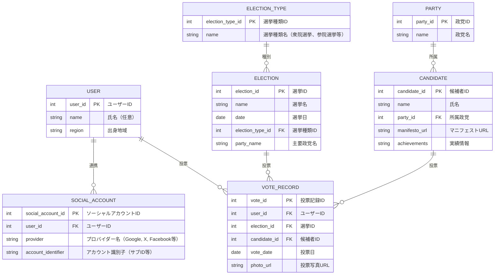

# ER 図

本システムのエンティティ・リレーション図（ER 図）は以下の通りです。

## エンティティ説明

- **USER（ユーザー）**

  - ユーザー ID（主キー）、氏名（任意）、出身地域

- **SOCIAL_ACCOUNT（ソーシャルアカウント）**

  - ソーシャルアカウント ID（主キー）、ユーザー ID（外部キー）、プロバイダー名（Google, X, Facebook 等）、アカウント識別子

- **ELECTION_TYPE（選挙種類マスタ）**

  - 選挙種類 ID（主キー）、選挙種類名（衆院選挙、参院選挙、都道府県長選挙、市長選挙等）

- **ELECTION（選挙）**

  - 選挙 ID（主キー）、選挙名、選挙日、選挙種類 ID（外部キー）、主要政党名

- **PARTY（政党）**

  - 政党 ID（主キー）、政党名

- **CANDIDATE（候補者）**

  - 候補者 ID（主キー）、氏名、所属政党（外部キー）、マニフェスト URL、実績情報

- **VOTE_RECORD（投票記録）**
  - 投票記録 ID（主キー）、ユーザー ID（外部キー）、選挙 ID（外部キー）、候補者 ID（外部キー）、投票日、投票写真 URL

## リレーション

- ユーザーは複数のソーシャルアカウントを持つ（1 対多）
- ユーザーは複数の投票記録を持つ（1 対多）
- 選挙種類は複数の選挙を持つ（1 対多）
- 選挙は複数の投票記録を持つ（1 対多）
- 候補者は複数の投票記録を持つ（1 対多）
- 政党は複数の候補者を持つ（1 対多）
