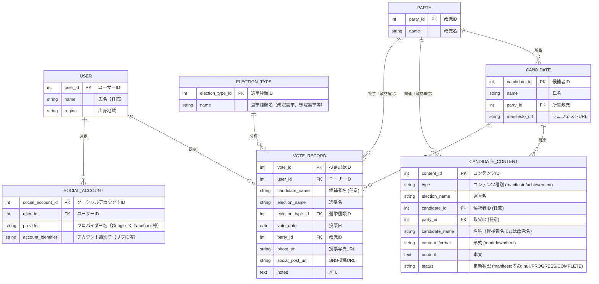

# ER 図

本システムのエンティティ・リレーション図（ER 図）は以下の通りです。

## エンティティ説明

- **USER（ユーザー）**

  - ユーザー ID（主キー）、氏名（任意）、出身地域

- **SOCIAL_ACCOUNT（ソーシャルアカウント）**

  - ソーシャルアカウント ID（主キー）、ユーザー ID（外部キー）、プロバイダー名（Google, X, Facebook 等）、アカウント識別子

- **ELECTION_TYPE（選挙種類マスタ）**

  - 選挙種類 ID（主キー）、選挙種類名（衆院選挙、参院選挙、都道府県長選挙、市長選挙等）

- **PARTY（政党）**

  - 政党 ID（主キー）、政党名

- **CANDIDATE（候補者）**

  - 候補者 ID（主キー）、氏名、所属政党（外部キー・任意）、マニフェスト URL

- **CANDIDATE_CONTENT（コンテンツ: マニフェスト・実績）**

  - コンテンツ ID（主キー）、種別（manifesto/achievement）、選挙名、候補者 ID（外部キー・任意）、政党 ID（外部キー・任意）、名称（候補者名または政党名）、形式（markdown もしくは html）、本文、更新状況ステータス（manifesto のみ：null=未更新 / PROGRESS=更新中 / COMPLETE=更新済み）。候補者 ID/政党 ID、選挙名、種別の組み合わせで一意

- **VOTE_RECORD（投票記録）**
  - 投票記録 ID（主キー）、ユーザー ID（外部キー）、候補者名（任意）、選挙名、選挙種類 ID（外部キー）、投票日、政党 ID（外部キー）、投票写真 URL、SNS 投稿 URL、メモ

## リレーション

- ユーザーは複数のソーシャルアカウントを持つ（1 対多）
- ユーザーは複数の投票記録を持つ（1 対多）
- 選挙種類は複数の投票記録を持つ（1 対多）
- 候補者マスタは参考情報として維持し、投票記録は候補者名を直接保持
- 政党は複数の候補者を持つ（1 対多）
- コンテンツ（CANDIDATE_CONTENT）は候補者または政党と紐づき、選挙名・種別と組み合わせて一意に管理される
- 政党は複数の投票記録を持つ（1 対多・政党投票対応）
