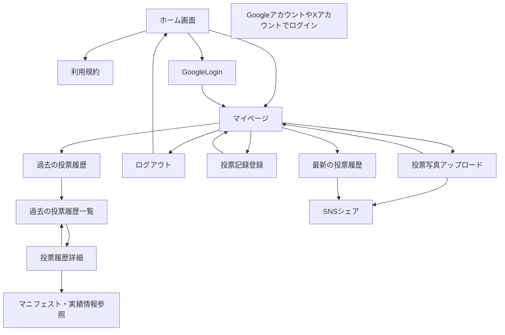

# Screen Transition Diagram

```mermaid
flowchart TD
    Home[ホーム画面]
    SocialLogin[GoogleアカウントやXアカウントでログイン]
    Terms[利用規約]
    MyPage[マイページ]
    LatestHistory[最新の投票履歴]
    Logout[ログアウト]
    Register[投票記録登録]
    PhotoUpload[投票写真アップロード]
    History[過去の投票履歴]
    HistoryList[過去の投票履歴一覧]
    HistoryDetail[投票履歴詳細]
    Manifest[マニフェスト・実績情報参照]
    Share[SNSシェア]

    %% ホーム画面
    Home --> GoogleLogin
    Home --> Terms
    Home --> MyPage

    %% ログインフロー
    GoogleLogin --> MyPage

    %% マイページ
    MyPage --> Logout
    MyPage --> Register
    MyPage --> PhotoUpload
    MyPage --> History
    MyPage --> LatestHistory

    %% ログアウト後はホーム画面
    Logout --> Home

    %% 投票記録登録・投票写真アップロードは独立
    Register --> MyPage
    PhotoUpload --> MyPage

    %% SNSシェア
    PhotoUpload --> Share
    LatestHistory --> Share

    %% 過去の投票履歴
    History --> HistoryList
    HistoryList --> HistoryDetail

    %% 投票履歴詳細からの遷移
    HistoryDetail --> Manifest
    HistoryDetail --> HistoryList

    %% 利用規約注記
    click Terms "利用規約は初回ログイン時またはフッター等からアクセス可能" "注記"
```
